## Introduction

---

This Shiny app is an interactive tools for **High throughput PCR library sequencing**, which performed for detectting gene editting effections. 

It is meant to provide an intuitive interface for researchers to easily **upload, analyze, visualize, and explore High throughput PCR library sequencing data** interactively with no prior programming knowledge in R.

## Features
---

Various **visualizations** and **output data** are included:

  
   

    

      <ul>
         <li>
            
<strong>Filtering</strong>

            <ul>
               <li>WT, SNP and Indel sequences</li>
            </ul>
         </li>
      </ul>

      

      
      

        <a class="pop">
            

                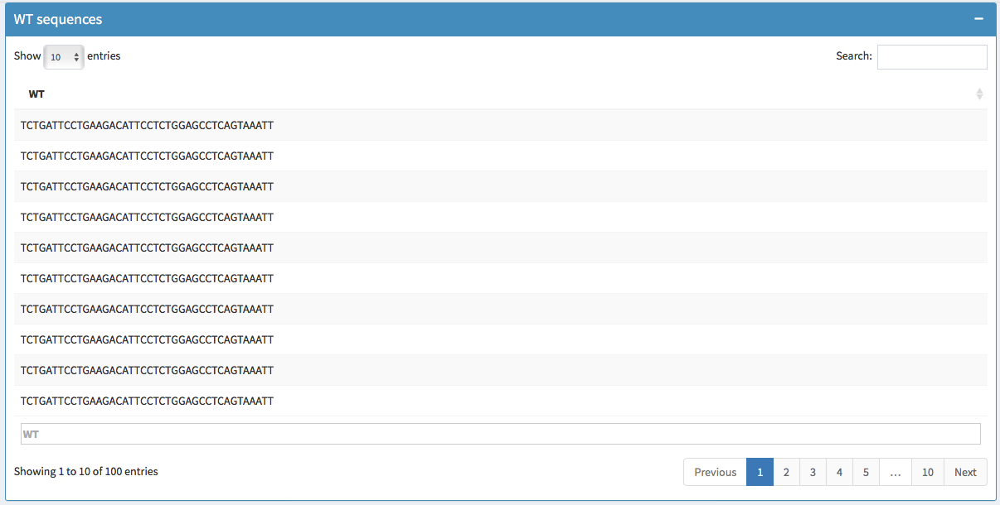
            

        </a>
      

      

        <a class="pop">
            

                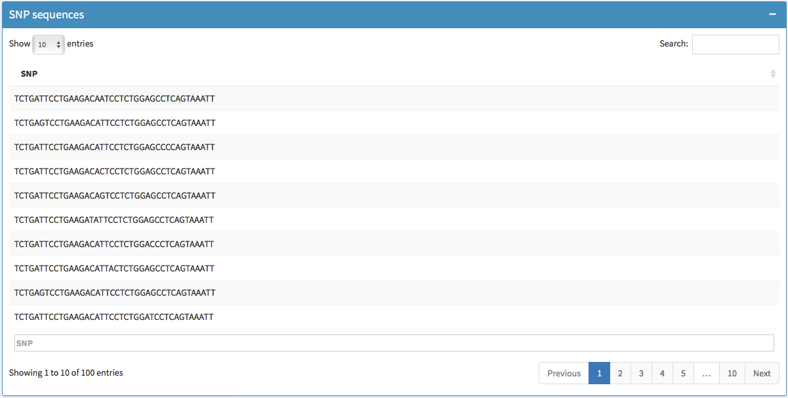
            

        </a>
      

      

        <a class="pop">
            

                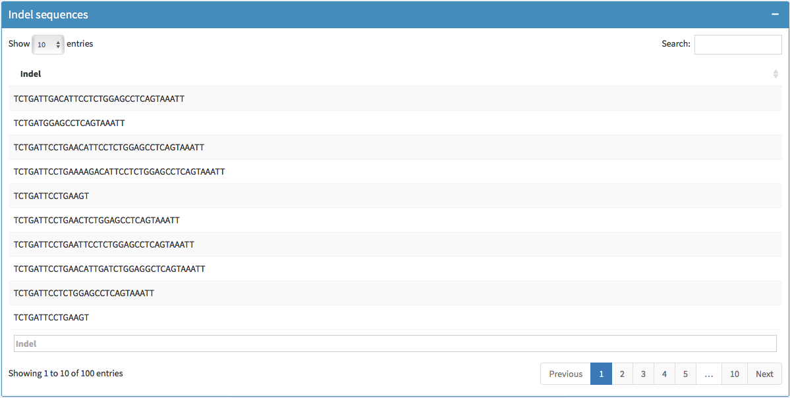
            

        </a>
      

   

  

  
  
   

    

      <ul>
         <li>
            
<strong>Mutations table</strong>

            <ul>
               <li>Total mutations & Indel mutation type table</li>
            </ul>
         </li>
      </ul>
      

      

        <a class="pop">
            

                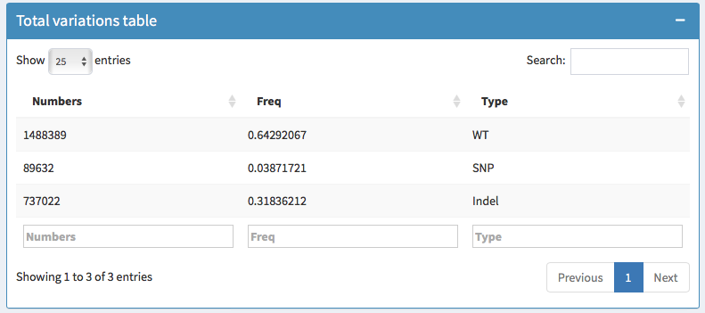
            

        </a>
      

      

        <a class="pop">
            

                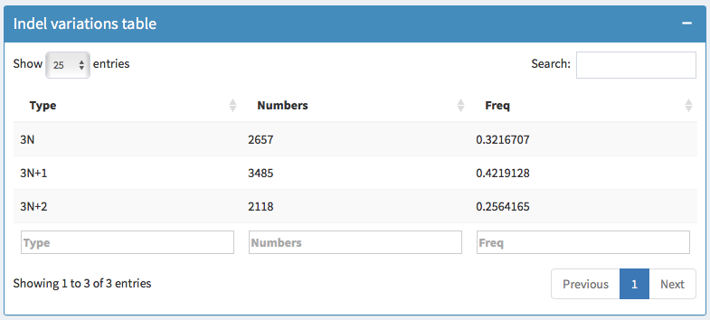
            

        </a>
      

   

  

  
  
   

    

      <ul>
         
         <li>
            
<strong>Barplot</strong> 

            <ul>
               <li>Barplots and Seqlogoplots</li>
            </ul>
         </li>
      </ul>
      

      

        <a class="pop">
            

                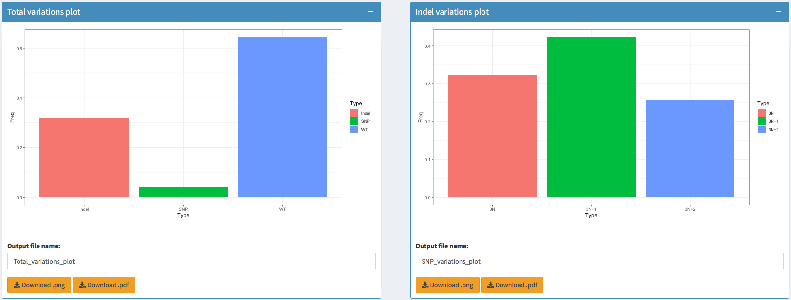
            

        </a>
      

      

        <a class="pop">
            

                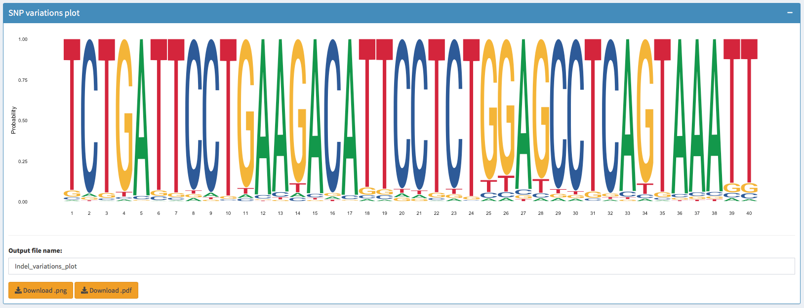
            

        </a>
      

   

  

  

    
              
      

      	<button type="button" class="close" data-dismiss="modal">&times;Close</button>
        
      

    

  

## Matters need attention

---
### 1. Install packages

- If you are using this software for the first time, run the dependencies script to install the package.

### 2. File name format

- A **fastq format** file that contains the **Raw sequenced reads.**

- If is **single-end sample**, names the sample as **sample1.fq.gz, sample2.fq.gz ...**.

- If is **paired-end sample**, names the R1 and R2 samples as **sample1_1.fq.gz sample1_2.fq.gz** respectively.

## Input File & Analysis

---

### 1. Example data (Demo)

- For demo purposes, you can select "Example Data" and carry out the analysis to get familiar with the app.

- That will automatically load the file **example.fq.gz** from **./example_data** directory.

### 2. Upload your own data 

- Select the file in the local directory, waitting the data upload complete and then click the **Upload data** button.

- Waitting for one or two minutes, until the **Raw sequences** table show up.

    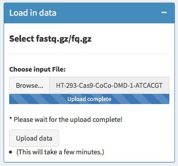

    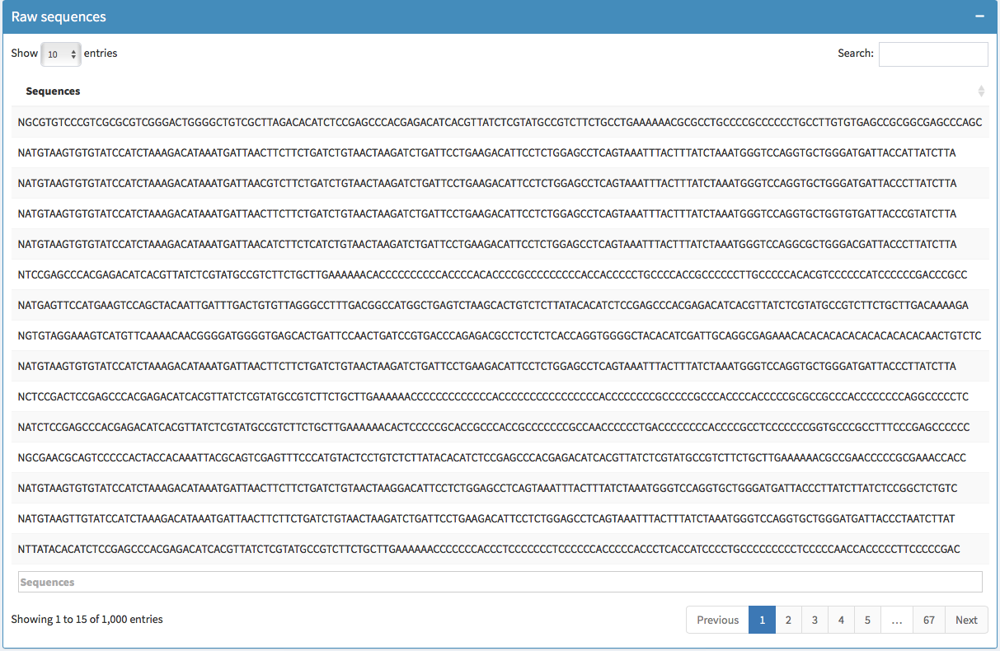

### 3. Prepare the target sequence

- Normally, the target sequence should be your **gRNA sequence + - 20bp**.

- There is a example of the **target Sequence structure** below:

    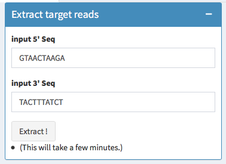

    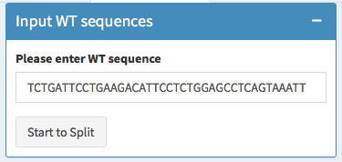

    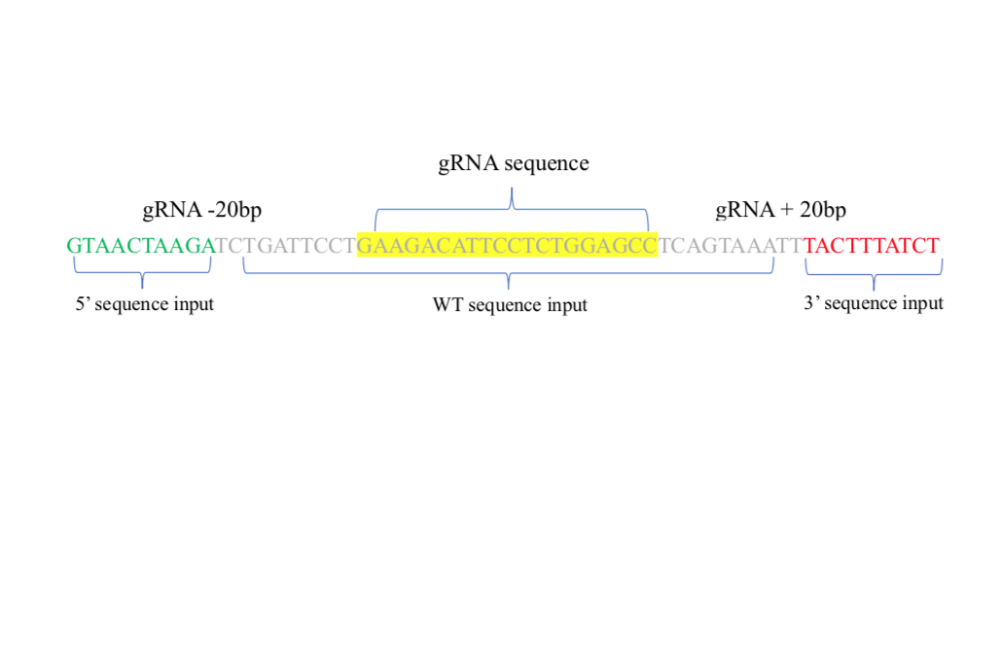

### 4. Data visualization

- The final result will be generated automatically.
- And the figures can be download in a **.png or .pdf** format.

<strong>Statistics of mutation rate.</strong>

    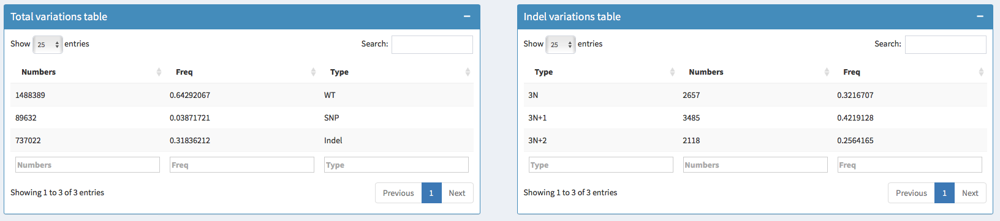

<strong>Barplot for Total and Indel mutation rate.</strong>

    

<strong>Seqlogo Plot for SNP mutation rate.</strong>

    

---

